# CSS-to-the-rescue

## Week 1

**Assignment:**  Control panel

**Concept:**  Optie 1: Donkey Kong Multiscreen. Door de handheld multiscreen-console geïnspireerd, wil ik deze console (3D) namaken, waarbij je met een paar buttons, zoals Jump, Walk en Game A/B, DK op de twee schermen kunt besturen.
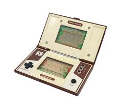

Optie 2: Pokédex Console: Een console met één scherm waarop je één of meerdere Pokémon ziet. Met behulp van buttons en/of een slider kun je de achtergrond (regio's) en Pokémon wisselen.
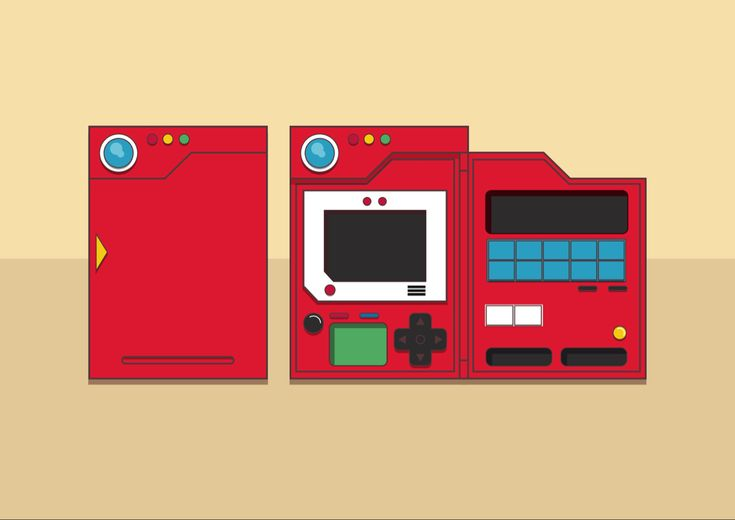

**Uiteindelijke keuze:**  Na de feedback op vrijdag van week 1 heb ik ervoor gekozen om met de eerste optie (Donkey Kong Multiscreen) verder te gaan, maar dan in de stijl van de tweede optie, waarin meer harde kleuren en schaduwen werden gebruikt.

---

## Week 2

**Nieuw voor mij:** 
<ul>
    <li>3D transform doormiddel van <code>transform-style: preserve-3d;</code></li>
    <li>kubus maken doormiddel van rotate en translate:<code>transform: rotateY(180deg) translateZ(calc(var(--base-z) / 2));</code></li>
    <li>dynamische maken cubus door custom var met calc te gebruiken<code>height: calc(calc(var(--base-y) / 2) / cos(45deg));</code></li>
</ul>

**Voortgang:** 
Deze week ben ik begonnen met het bouwen met een cubus door te spelen met 3D-transform. Dit heb ik maandag geprobeerd in een codepen en dinsdag in mijn eindproject gewerkt waar ik het ook dynamisch heb kunnen maken door middel van custom properties en het gebruik van math. Als laatst heb ik nog met Sanne gekeken hoe ik een beveld edge kon maken en heb ik hiervoor uitendelijk gebruik gemaakt van de cos(45) regel in een calc.

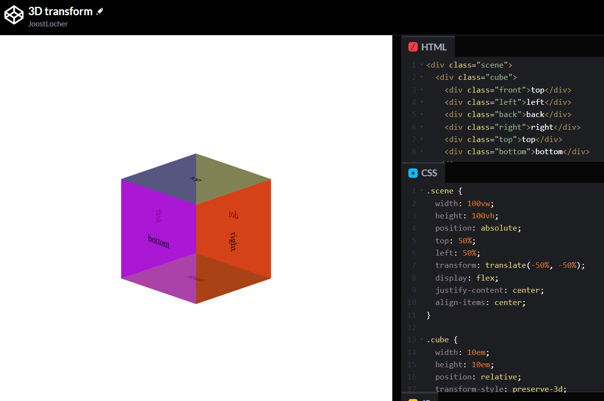
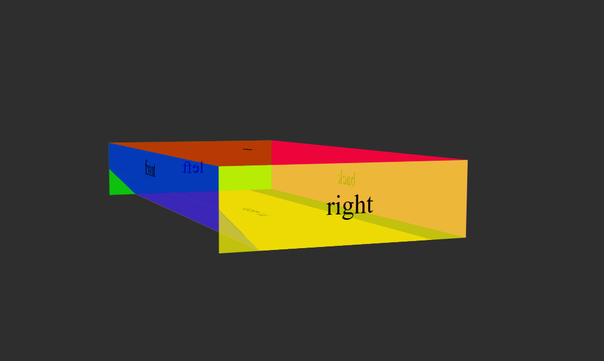

**Doel volgende week:** 
- Onderkant en bovenkant afmaken en stijlen.
- Knoppen en shermen toevoegen.

## Week 3

**Nieuw voor mij:** 
<ul>
    <li>transform origin gebruiken en verplaatsen voor een 3d object <code>transform-origin: 50% calc(var(--base-y) / -2) calc(var(--base-z) / -2);</code></li>
</ul>

**Voortgang:** 
Maandag begon ik meteen met het stijlen van de console in de kleuren van donkey kong en heb deze in variable opgeslaan en toegepast. 
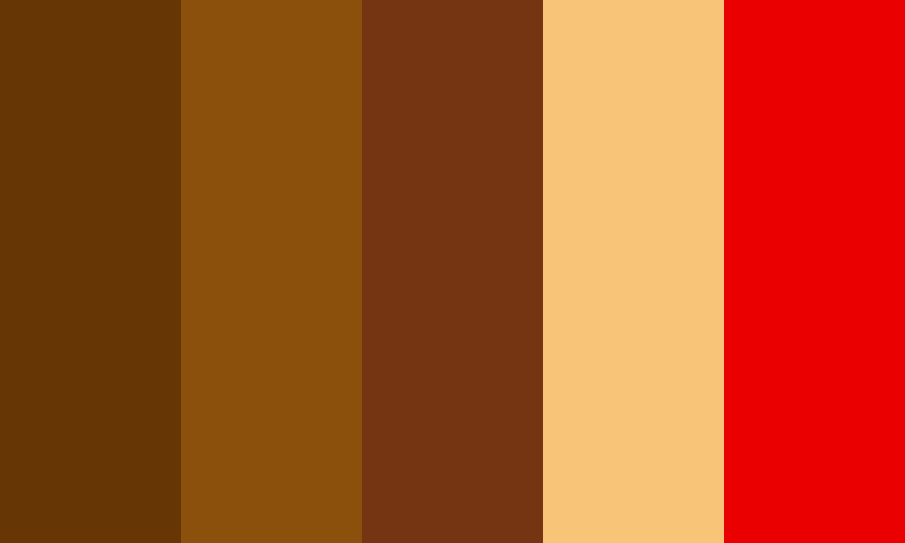 

Nadat de onderkant basis helemaal klaar was heb ik de hele <code>ul</code> waarin het stond gekopieerd en er boven geplakt. Vervolgens heb ik deze met <code>rotate: z 180deg;</code> omgedraait en naar boven geschoven om hem op het onderdeel neer te leggen. 
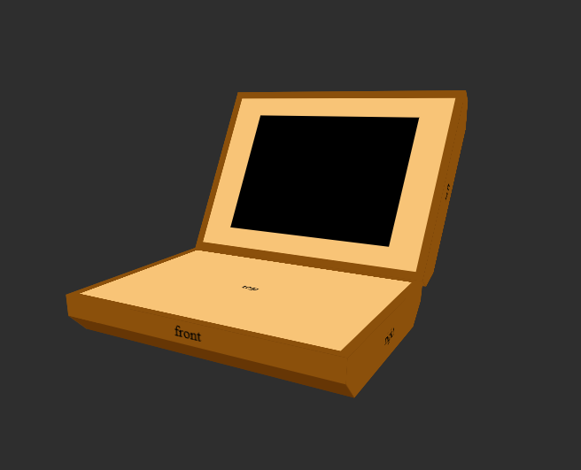 

Dinsdag was ik begonnen met het maken van een animatie waarme je de console open en dicht kon klappen. Hiervoor wou ik eerst het heel moeilijk raar roteren en daarna verplaatsen, maar daarna kwam Sanne met de goede tip om naar de <code>transform-origin</code> te kijken. Hier worstelde ik wel eerst een beetje omdat het niet één vlak was maar een kubus met een middenpunt, dus moest ik de transform origin verplaatjes met calc en mijn var waardes. Dit duurde even en liep eerst lang tegen het probleem aan dat de ul een width had terwijl ik die op 0 had gezet. Uiteindelijk bleek het te komen door de <code>padding-inline-start</code> en moest deze op 0 staan, maar het was gelukt en had dit in een animatie gezet met keyframes en een 3d kubus button. 
 

**Doel volgende week:** 
- Interactie toevoegen (knoppen: links, recht, jump en smash)
- Bijpassende title toevoegen
- Alles goed nesten
- puntjes op de i

## Week 4

**Nieuw voor mij:** 
<ul>
    <li>3D cylinder <code>--radius: calc(var(--move-x) / 2 );</code> 
        <code>--n: 9;</code> 
        <code>--length: calc(var(--radius) * 2 * tan(180deg / var(--n)));</code> 
        <code>--angle: calc(360deg / var(--n));</code> 
        <code>transform: translateX(-50%) rotateY(calc(var(--angle) * var(--i))) translateZ(var(--radius));</code></li>
    <li>Object bewegen door inputs en translate <code>&:has(#lr-2:checked) >section>ul:nth-of-type(1)>li:nth-of-type(7) img { right: calc(30% - var(--dk-size) / 2); }</code></li>
    <li>...<code>...</code></li>
</ul>

**Voortgang:** 
Voor de laatste week begon ik met het maken van de beweeg knoppen. Hiervoor had ik even op het internet gekeken en kwam ik een css space invaders van Jon Slater tegen die doormiddel van inputs, labels en transforms objecten kon laten bewegen. Verder wist ik ook dat Elton ook zo iets had gemaakt en die bleek ook naar de codepen van Slater had gekeken. Elton heeft mij toen ook maandag hier mee samen even een codepen aangemaakt om de basis wat makkelijker uit te leggen. Dit heb ik vervolgens toegepast op mijn console. 
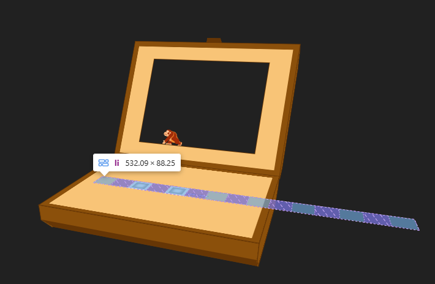 

Tijdens de les van maandag was Julia Miocene ook te gast en had toen ook een 3d cylinder op haar youtube gezien die ik mogelijk kon gebruiken voor de ronde knoppen op mijn console. Ik heb dan ook de video gevolgd en een passende clip-path toegevoegd voor de boven vlak van de cylinder, want die had zijn niet. En met wat transforms op het onderflak geplaatst en samen gevoegd met de inputs voor het bewegen. 
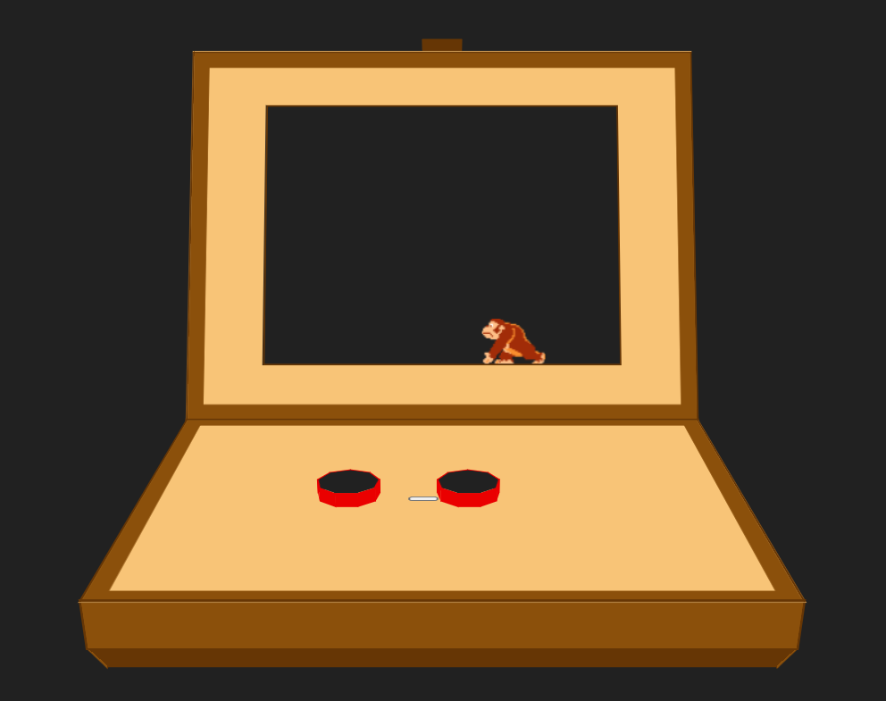 

Dinsdag was ik begonnen met het animeren van de buttons en het juist verplaatsen van dk op het scherm. Bij beide liep ik op tegen veel opstakels. Zo heb ik veel geprobeert met verschillende manier om dk te verplaatsen, zie afb. hieronder: 
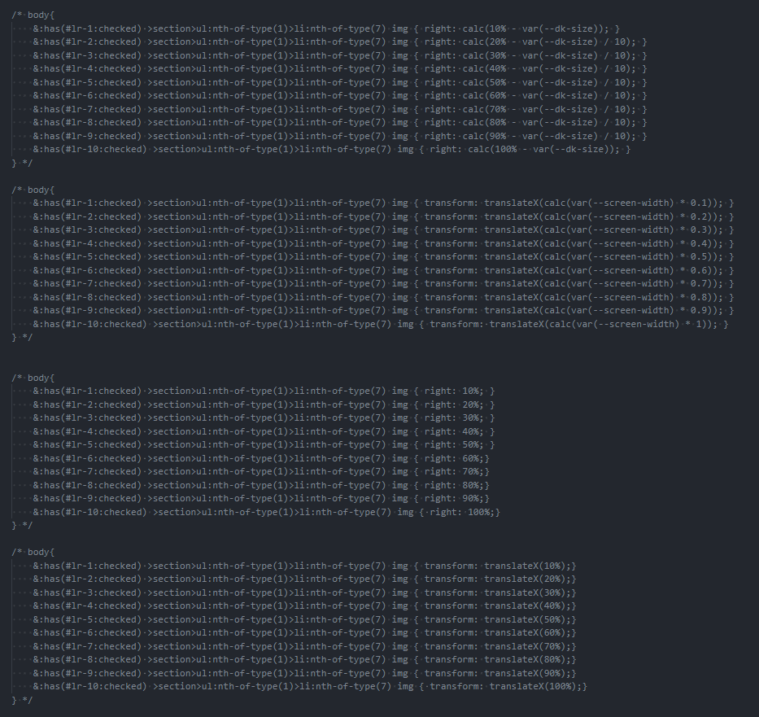 

Uiteindelijk heb ik met <code>right: x%</code> gedaan maar bij 100% kwam hij eerst uit het beeld, en als je dan in de calc 100% - size-dk deed was hij op 0% weer niet goed. Ik het dan maar ook oneven stappen in % gedaan maar visueel lijkt het gelijken stappen.

Het animeren van de buttons verliep ook niet soepel want de bovenkanten van de cylinders zijn een before en after maar met translate in keyframes krijg ik ze niet op en neer, alleen werkt het wel als ik de hele ul pak maar waardoor ik niet maar 1 van de 1 naar benede krijg. Verder werkte de animaties alleen op de eerst keer van links en naar rechts bewegen...

als laatst heb ik ook nog een jump en smash knop toegevoegd met een daarbij passende animatie. Voor de title had ik een pixel font van google geimplenteerd.

**Eindresultaat:**
 
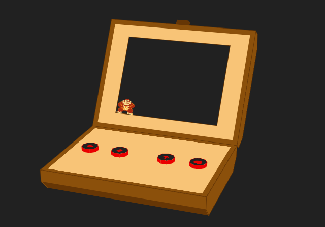 
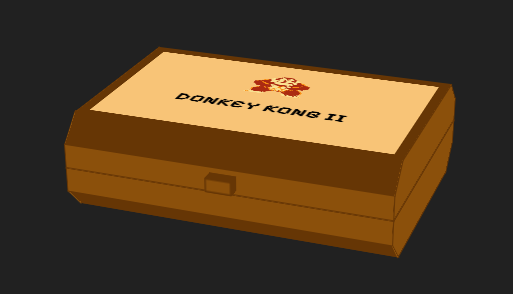 

## Herkansing

Voor de herkansing moest ik nog een 2e CSS architecture feature toevoegen. Ik had al CCS nesting en heb nu style queries toegevoegd. Dit heb ik gedaan voor het bewegen van de DK-img Hiervoor had ik eerst mijn checkboxen naar radio buttons veranderd en daarna met has een variable aan elk toegevoegd:

<code>
  body:has([value="pos0"]:checked) { --position: 0;}
  body:has([value="pos1"]:checked) { --position: 1;}
  body:has([value="pos2"]:checked) { --position: 2;}
</code>
 
Hierop volgend voor elk een container style geschreven met daarin de code die ik al had voor het bewegen van de img en labels. <code> @container style(--position: 1) {} </code> 

## Bronnen

<ul>
    <li>img DK: https://www.homecomputermuseum.nl/collectie/nintendo/nintendo-game-watch-donkey-kong-ii/</li>
    <li>img pokedex: https://nl.pinterest.com/pin/418060777921719484/</li>
    <li>3D cubus: https://codepen.io/shooft/pen/BaQLpQq?editors=1100, https://3dtransforms.desandro.com/cube</li>
    <li>3D transform: https://www.w3schools.com/css/css3_3dtransforms.asp</li>
    <li>color pallet dk: https://htmlcolors.com/palette/905/donkey-kong</li>
    <li>dk laten bewegen: Elton Irokromo & https://codepen.io/jonslater204/pen/LYWQbMa?editors=1100</li>
    <li>3D cylinder van Julia Miocene: https://codepen.io/miocene/pen/poXJOpo*/</li>
    <li>nonagon clip-path shape: https://bennettfeely.com/clippy/</li>
    <li>color emoji: https://barrd.dev/article/adding-colour-to-an-emoji-using-different-css-techniques/</li>
    <li>font: https://fonts.google.com/specimen/Pixelify+Sans?preview.text=DONKEY%20KONG%20II</li>
    <li>style query: https://developer.mozilla.org/en-US/docs/Web/CSS/CSS_containment/Container_size_and_style_queries</li>
</ul>
