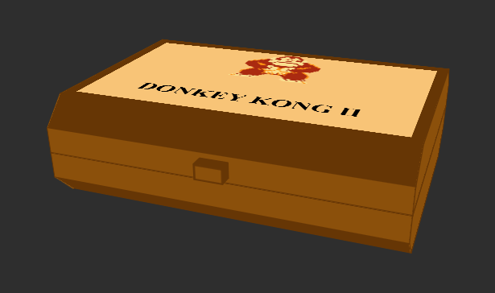

# CSS-to-the-rescue

## Week 1

**Assignment:**  Control panel

**Concept:**  Optie 1: Donkey Kong Multiscreen. Door de handheld multiscreen-console geïnspireerd, wil ik deze console (3D) namaken, waarbij je met een paar buttons, zoals Jump, Walk en Game A/B, DK op de twee schermen kunt besturen.

Optie 2: Pokédex Console: Een console met één scherm waarop je één of meerdere Pokémon ziet. Met behulp van buttons en/of een slider kun je de achtergrond (regio's) en Pokémon wisselen.

**Uiteindelijke keuze:**  Na de feedback op vrijdag van week 1 heb ik ervoor gekozen om met de eerste optie (Donkey Kong Multiscreen) verder te gaan, maar dan in de stijl van de tweede optie, waarin meer harde kleuren en schaduwen werden gebruikt.

---

## Week 2

**Nieuw voor mij:** 
<ul>
    <li>3D transform doormiddel van <code>transform-style: preserve-3d;</code></li>
    <li>kubus maken doormiddel van rotate en translate:<code>transform: rotateY(180deg) translateZ(calc(var(--base-z) / 2));</code></li>
    <li>dynamische maken cubus door custom var met calc te gebruiken<code>height: calc(calc(var(--base-y) / 2) / cos(45deg));</code></li>
</ul>

**Voortgang:** 
Deze week ben ik begonnen met het bouwen met een cubus door te spelen met 3D-transform. Dit heb ik maandag geprobeerd in een codepen en dinsdag in mijn eindproject gewerkt waar ik het ook dynamisch heb kunnen maken door middel van custom properties en het gebruik van math. Als laatst heb ik nog met Sanne gekeken hoe ik een beveld edge kon maken en heb ik hiervoor uitendelijk gebruik gemaakt van de cos(45) regel in een calc.

**Doel volgende week:** 
- Onderkant en bovenkant afmaken en stijlen.
- Knoppen en shermen toevoegen.

## Week 3

**Nieuw voor mij:** 
<ul>
    <li>transform origin gebruiken en verplaatsen voor een 3d object<code>transform-origin: 50% calc(var(--base-y) / -2) calc(var(--base-z) / -2);</code></li>
</ul>

**Voortgang:** 
Maandag begon ik meteen met het stijlen van de console in de kleuren van donkey kong en heb deze in variable opgeslaan en toegepast. 
 

Nadat de onderkant basis helemaal klaar was heb ik de hele <code>ul</code> waarin het stond gekopieerd en er boven geplakt. Vervolgens heb ik deze met <code>rotate: z 180deg;</code> omgedraait en naar boven geschoven om hem op het onderdeel neer te leggen. 
 

Dinsdag was ik begonnen met het maken van een animatie waarme je de console open en dicht kon klappen. Hiervoor wou ik eerst het heel moeilijk raar roteren en daarna verplaatsen, maar daarna kwam Sanne met de goede tip om naar de <code>transform-origin</code> te kijken. Hier worstelde ik wel eerst een beetje omdat het niet één vlak was maar een kubus met een middenpunt, dus moest ik de transform origin verplaatjes met calc en mijn var waardes. Dit duurde even en liep eerst lang tegen het probleem aan dat de ul een width had terwijl ik die op 0 had gezet. Uiteindelijk bleek het te komen door de <code>padding-inline-start</code> en moest deze op 0 staan, maar het was gelukt en had dit in een animatie gezet met keyframes en een 3d kubus button. 
 

**Doel volgende week:** 
- Interactie toevoegen (knoppen: links, recht, jump en smash)
- Bijpassende title toevoegen
- Alles goed nesten
- puntjes op de i

## Week 4

**Nieuw voor mij:** 
<ul>
    <li>...<code>...</code></li>
    <li>...<code>...</code></li>
    <li>...<code>...</code></li>
</ul>

**Voortgang:** 
...

## Bronnen

<ul>
    <li>img DK: https://www.homecomputermuseum.nl/collectie/nintendo/nintendo-game-watch-donkey-kong-ii/</li>
    <li>img pokedex: https://nl.pinterest.com/pin/418060777921719484/</li>
    <li>3D cubus: https://codepen.io/shooft/pen/BaQLpQq?editors=1100, https://3dtransforms.desandro.com/cube</li>
    <li>3D transform: https://www.w3schools.com/css/css3_3dtransforms.asp</li>
    <li>nonagon clip-path shape bron: https://bennettfeely.com/clippy/</li>
    <li>...</li>
    <li>...</li>
</ul>
